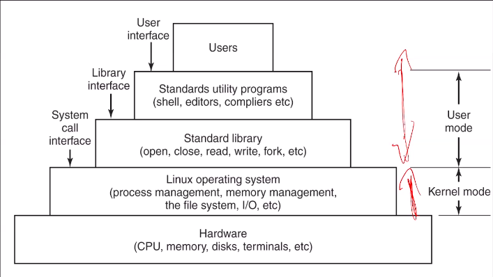

# Introduction to Software Systems (CS6.201)
## Summer 2021, IIIT Hyderabad
## 25 May, Tuesday (Lecture 1)

Taught by Prof. Raghu Reddy

## Course Objective
The aim of this course is to provide a working knowledge on tools and processes for building simple software systems.

## What is a System?
The commonly used/understood definition of a system is a "set of interrelated components working together to achieve a common objective".  
A system may be natural or engineered. Further, all systems have boundaries beyond which their behaviour is undefined.

## Features of Systems
* Programs
* Teams
* Processes
* Design
* Communication

## Systems vs Application Software
Systems software fundamentally helps to communicate with hardware, at a much lower level. Application software, on the other hand, is higher-level programming.

## The Shell
The kernel executes all the commands we give it through the shell.  
The shell is a program (command-line interpreter) that allows the user to interact with the Unix/Linux system. Examples of shells are `sh` (Bourne shell), `bash` (Bourne again shell), `zsh` (Z shell), etc.
