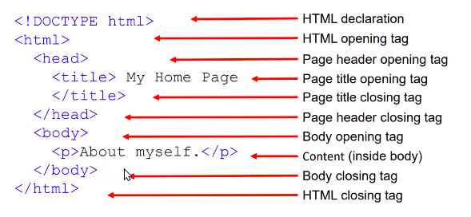

# Introduction to Software Systems (CS6.201)
## Summer 2021, IIIT Hyderabad
## 08 June, Tuesday (Lecture 5)

Taught by Sai Anirudh Karri

## History of Web Technologies
It was understood that in matters of communication, the shell had limited capabilities. Therefore a new type of shell was created for this, named ARPANet. This was the predecessor of the internet.  

HTML was a technology created to help broadcast a page of information to various nodes in the connected network. Rather than actually sending the information, it only sent the _location_ of the folder (in a shared server), which is the URL of the page.  

Computers are connected to the internet through submarine cables across the world.

## HTML – Hypertext Markup Language
It is not based on the command-line; it is a tag-based language for publishing hypertext. Its standard is decided by an W3C, an open source organisation.  
A web browser is an application to find and display the file retrieved from the internet servers through HTML.  

The basic structure of an HTML document is as follows.

The text between an opening tag and its corresponding closing tab is called its _scope_. There are tags for headings, paragraphs, _emphasis_ (italics), **strong text** (boldface), lists (unordered and ordered), media (images, audio, video), tables, etc. A complete list of tags can be found [here](https://html.com/tags/).
